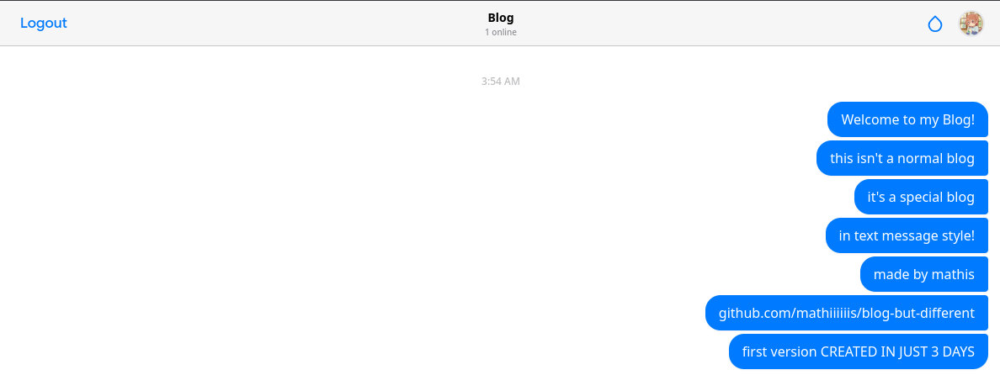
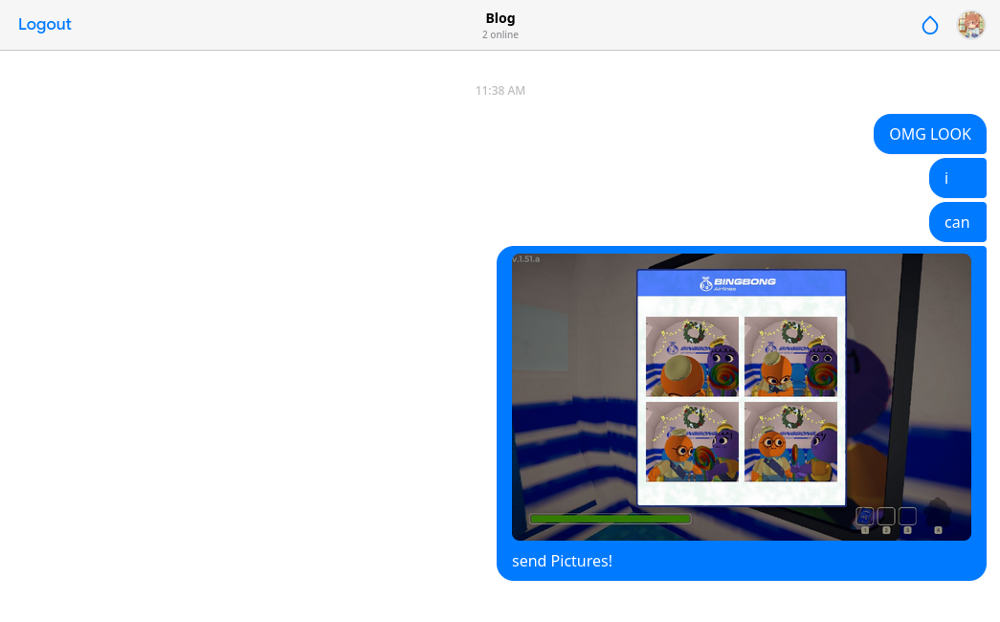
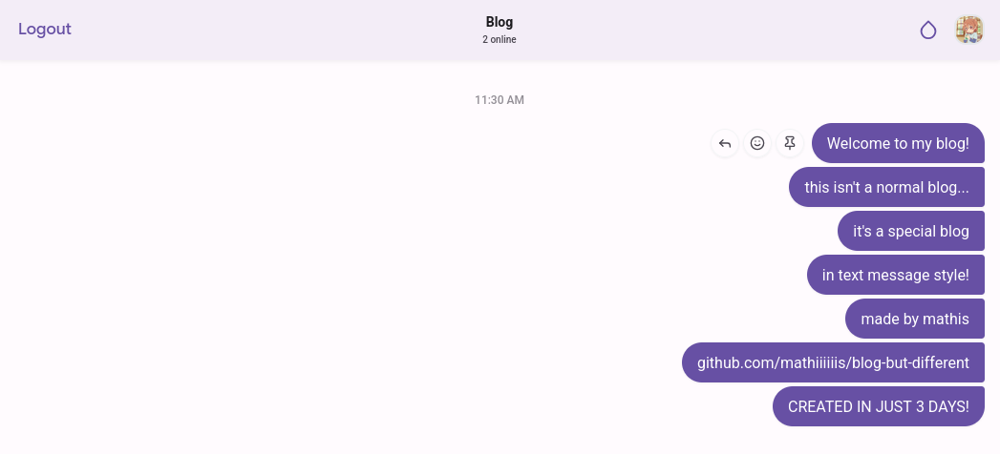
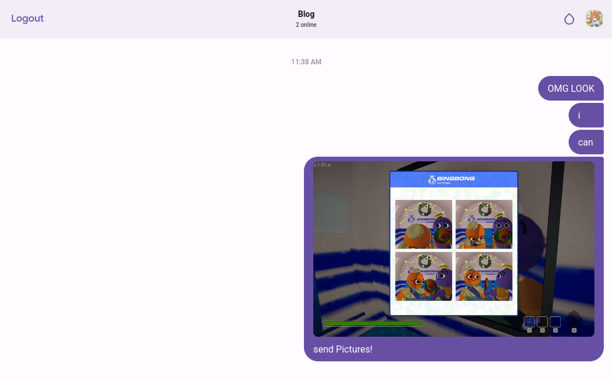

# A Blog But Different

This is a blog, but not the usual kind. Instead of long posts, it works like a live chat. I am the only one who can post messages, while everyone else can react in real time.
The idea came from hating traditional blog writing, but still wanting to share updates, thoughts, and media in a fast and interactive way. Think of it as a public chat feed that replaces classic blog posts.

The UI is inspired by the iMessage layout, with an optional switch to Material Design 3. Messages can include text, images, audio, and video, making the blog feel alive instead of static.

<br>

## Preview


| <span style="font-size:1.4em;font-weight:bold">iMessage Style</span> | <span style="font-size:1.4em;font-weight:bold">MD3 Style</span> |
|----------------------------------------------------------------------|---------------------------------------------------------------------------|
| <br> | <br> |

<br>

## Quick Start (Development)

### Start services

```bash
docker-compose -f docker-compose.dev.yml up -d --build
````

### Access the app

* **Frontend**: [http://localhost:3000](http://localhost:3000)
* **Backend API**: [http://localhost:8000/docs](http://localhost:8000/docs)

<br>

## Production Deployment

### Prerequisites

* Docker and Docker Compose
* A domain name (optional, but recommended)

### 1. Environment configuration

Create a `.env` file in the project root.
Copy the values from `.env.example` and adjust them as needed.

### 2. Deploy

Run the production compose file:

```bash
docker-compose up --build
```

The application will be available on port **80**.

(It is highly recommended to place a reverse proxy such as Nginx or Traefik in front of the container to handle SSL and HTTPS termination.)

## Admin Commands

* `/clear` delete all messages and reactions
* `/pin <text>` post a pinned message directly